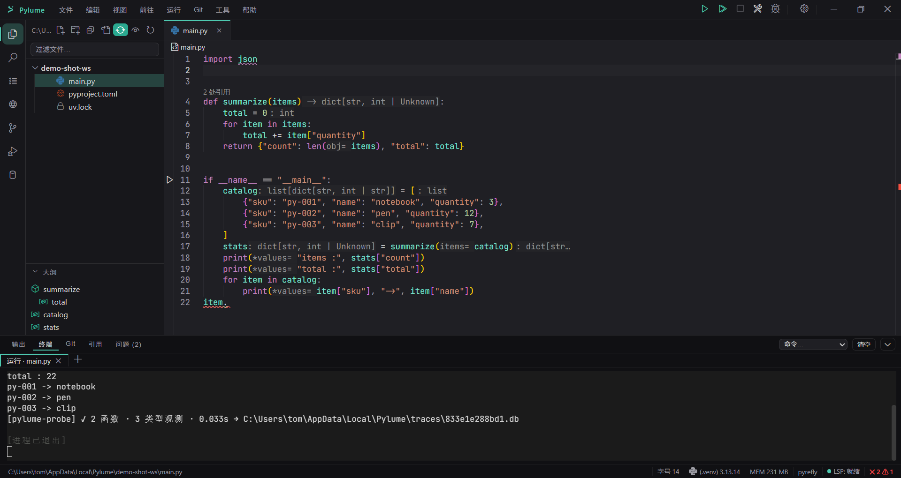
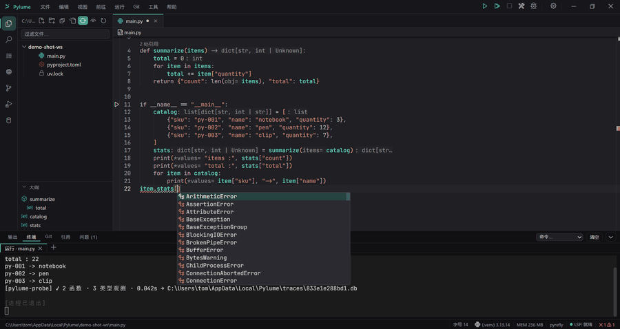

# Pylume

[](https://github.com/usedel/pylume/actions/workflows/ci.yml)
[](https://github.com/usedel/pylume/releases)
[](LICENSE)
[](#quick-start)
[](https://tauri.app)

**A lightweight Python IDE for FastAPI services, scrapers, and small scripts.**

[简体中文](README.zh-CN.md)

Most Python editors infer types from the annotations you wrote. Pylume also infers them from **what your code actually did when you ran it** — so untyped `dict`s, `Any`, and scraper payloads still complete correctly.

---

## Why I built this

I write a lot of small Python — FastAPI services, scrapers, throwaway scripts. For a long time that meant picking between two tools that annoyed me in opposite ways.

**I genuinely like PyCharm.** Its understanding of Python is still the best I've used: the refactoring, the navigation, the debugger. Two things got in the way. First, the parts I actually use daily sit behind the Pro subscription — FastAPI and Flask support, the database tools, the *Endpoints* panel; the free tier stops at core Python. Second, it's a JVM application: slow cold start, a background indexer, and a memory footprint that starts in the hundreds of megabytes before I've typed a single line. That is a lot of machine for a 200-line scraper.

**VS Code is the opposite trade-off.** Free and quick to launch, but it's a text editor until you spend an evening on it — install the Python extension, pick an interpreter, wire up linting, formatting and debugging, then keep the whole thing working. It's also an Electron app, and I didn't want a Node.js runtime sitting between me and my Python.

Pylume is what I wanted instead: **a native Windows app that understands Python on first launch**. No subscription, no extension hunt, no JavaScript toolchain on the user's machine.

> **On Node.js, to be precise:** Pylume ships as a native installer (Tauri 2 + WebView2). *Running* it needs no Node.js and no Python setup — uv, Pyrefly and debugpy are bundled or fetched on first launch. Node 22 is required only if you **build Pylume from source**, because the editor surface is Monaco.

---

## See it in action

No type annotations anywhere in this file. Run it once, and the editor knows the real shapes:

```python
import requests

def fetch_items(url):
    r = requests.get(url)        # r      -> Response     ⟳ runtime
    return r.json()["items"]     # items  -> list[dict]   ⟳ runtime

for item in fetch_items(url):    # item   -> dict         ⟳ runtime
    print(item["sku"])           # keys suggested from real payload shapes
```

The `⟳ runtime` marker means the suggestion came from a type the code actually produced at runtime, not from an annotation you wrote. Nothing is inferred by guessing, and nothing is sent anywhere — the samples stay in a local SQLite file.

## Screenshots

The editor, with types inferred by Pyrefly shown inline and the file tree on the left:



Type `item.` on a dict that has no annotations, and the members come back with real types.
Down in the terminal you can see the probe sampling them as the script runs
(`✓ 2 functions · 3 type observations` → written to a local trace DB):



## What's actually different

Static analysis only sees the annotations you wrote. Pylume also **looks at what your code actually produced at runtime**:

1. When you run a script, a probe (`probe/`) uses PEP 669 `sys.monitoring` to sample the real types of variables and calls, and writes them to a local SQLite trace database.
2. A runtime intelligence service, `pylume-intel`, opens that database read-only, builds an inverted index, and serves completion / goto / hover as a **standalone LSP**.
3. The shell merges static-engine results with runtime results at fixed ranking slots. Runtime-sourced entries are marked `⟳ runtime` and land where you'd expect them.

For `dict`, `Any`, and the unannotated return value of a scraper, that's the difference between completion that works and completion that doesn't.

---

## How it compares

| | Pylume | PyCharm | VS Code + Python extension |
|---|---|---|---|
| Completion on untyped code | Runtime sampling | Static inference | Static inference |
| Ready on first launch | Yes | Needs interpreter setup | Needs extensions + config |
| Cost | Free (MIT) | Free core tier; **Pro subscription** for FastAPI / DB tools / Endpoints | Free |
| Runtime dependencies | None — native installer | JVM | Electron / Node.js |
| Platforms | **Windows only** | Windows, macOS, Linux | Windows, macOS, Linux |
| Best at | FastAPI, scrapers, small scripts | Large Python codebases | Anything, given enough extensions |

Pylume is deliberately narrower than the other two. It isn't trying to be a general-purpose IDE — it's trying to be the one you open for a 200-line script.

## Features

| Area | Status |
|---|---|
| Editor | Monaco: multi-tab / split view / breadcrumbs / bookmarks / reference count / inline values |
| Semantics | Completion · goto · hover · diagnostics (Pyrefly by default, basedpyright switchable) |
| Runtime intelligence | PEP 669 sampling + `pylume-intel` — completion for unannotated code |
| Run | Script and project modes · unified PTY console · parallel instances · clickable tracebacks |
| Debug | debugpy bundled + in-house DAP bridge: breakpoints / stepping / call stack / variables |
| Also | Git (incl. remote clone) · SQLite tool · Markdown preview · dependency health · library-specific help (re / format strings / JSON) · multi-window · terminal · global search · tool plugins · zh-CN & en-US |

**Explicitly not planned:** pytest panel, AI features, plugin marketplace, collaborative editing. The boundary is defined in `docs/python_ide_dev_plan_v2.md` §1.1.

---

## Architecture

```
shell/    Tauri 2 + Monaco shell (frontend: vanilla TS + Vite; backend: Rust src-tauri)
probe/    pylume-probe: PEP 669 runtime sampling (standalone Python package, zero third-party deps)
intel/    pylume-intel: the runtime-intelligence LSP that consumes the trace DB (standalone Rust process, stdio)
bench/    benchmark projects + metrics collection
ci/       pinned dependency versions (versions.toml)
docs/     design · dev plan · ADRs · acceptance records (in Chinese)
```

Data flow: run → the PTY injects env vars that boot the probe → samples land in the trace DB (`~/.pylume/traces/<project-hash>.db`) → intel reads it read-only and indexes → the shell's LSP bridge merges results into Monaco.

Every in-house component is an **independent process or package** — none of them patch the shell or the static engine's internals, and the static engine has been swappable since day one.

---

## Quick start

### Just use it

Download the installer (NSIS) from Releases. uv, Pyrefly and debugpy are bundled or installed on first launch, so a clean Windows machine works out of the box.

### Build from source

Requirements: Node 22 · Python 3.13 (managed by uv) · Rust 1.96 · **Windows** (the only supported platform today).

```powershell
# 1) Fetch the bundled debugpy (sha256-pinned from ci/versions.toml; output is not committed)
powershell -File .\tools\fetch-debugpy.ps1

# 2) Frontend + shell in dev mode
cd shell
npm install
npm run tauri dev

# 3) One-shot packaging (run from repo root)
powershell -File .\build-release.ps1
```

Installer output: `shell/src-tauri/target/release/bundle/nsis/`. Logs: `~/.pylume/logs/pylume.log`.

### Common commands

| Goal | Command |
|---|---|
| Frontend unit tests | `cd shell && npm test` |
| E2E (mock layer) | `cd shell && npx playwright test` |
| Real-device acceptance (manual) | `shell\e2e-real\run-*.bat` |
| Rust shell | `cd shell/src-tauri && cargo test` |
| Probe | `cd probe && uv sync && uv run pytest` |
| Runtime intelligence | `cd intel && cargo build -p pylume-intel` (must **build**, not `test`, before debugging against the shell) |
| UI token gate | `python tools/ui/audit_tokens.py` |

---

## Documentation map

| Entry point | What it covers |
|---|---|
| [`docs/delivery-overview.md`](docs/delivery-overview.md) | **Delivery overview**: 20 feature areas × plan of record × acceptance record × status |
| [`docs/python_ide_tech_plan_v3.md`](docs/python_ide_tech_plan_v3.md) | Technical design (Tauri + Monaco shell architecture) |
| [`docs/python_ide_dev_plan_v2.md`](docs/python_ide_dev_plan_v2.md) | Development plan (incl. the "not doing" list) |
| [`docs/adr/`](docs/adr/) | Architecture decision records: LSP bridge · DAP + debugpy · brand color · dual engines · PEP 669 · completion merge |
| [`docs/tech-debt.md`](docs/tech-debt.md) | Tech-debt ledger |

Most docs are written in Chinese. Where the technical plan and the development plan disagree, the **development plan wins**; where two versions of the same doc disagree, the higher version number wins.

---

## Known limits

- **Pydantic**: Pyrefly doesn't statically validate `BaseModel` construction, so Pylume adds its own diagnostics (wrong types / missing required fields / unknown fields) via lightweight text parsing — inheritance chains across files are not merged.
- **Real-device E2E is not in CI** (the nightly job only warns); automated gates cover Windows only.
- Debugging and running each carry a few manual acceptance items; see the corresponding acceptance records.

---

## Contributing

See [`CONTRIBUTING.md`](CONTRIBUTING.md). For security issues, follow [`SECURITY.md`](SECURITY.md) — please don't open a public issue.

## License

[MIT](LICENSE). Third-party component licenses are listed in [`THIRD-PARTY-NOTICES.md`](THIRD-PARTY-NOTICES.md).

Pylume is not affiliated with JetBrains; PyCharm is a registered trademark of JetBrains.
